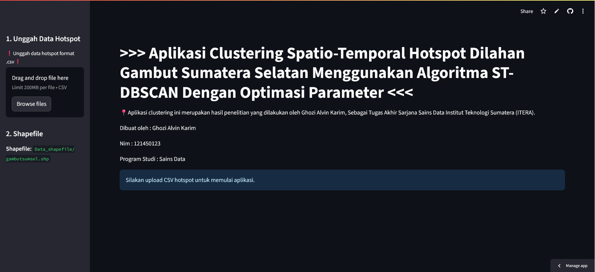
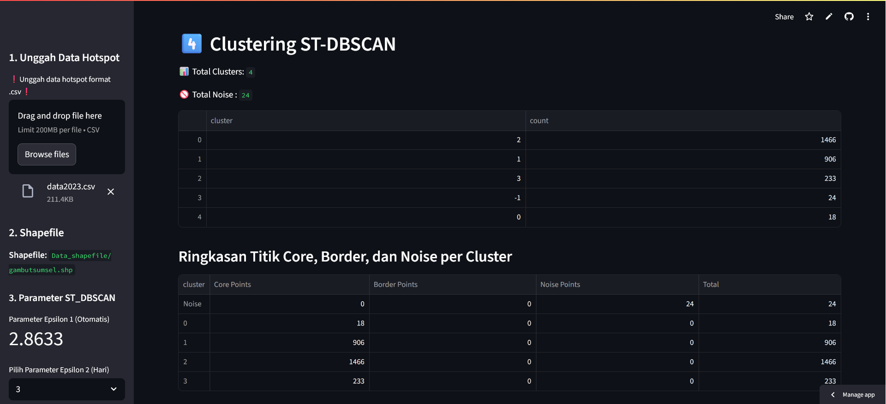

# Aplikasi Clustering Spatio-Temporal Hotspot Gambut SUMSEL

> **ST-DBSCAN**: Clustering Spatio-Temporal Hotspot pada Lahan Gambut Sumatera Selatan dengan Optimasi Parameter

---

## 📌 Deskripsi

Aplikasi ini adalah hasil penelitian
Tugas Akhir Sarjana Sains Data oleh **Ghozi Alvin Karim** (NIM: 121450123, Institut Teknologi Sumatera). Menggunakan algoritma **ST-DBSCAN** (Spatio-Temporal DBSCAN) untuk mendeteksi pola klaster hotspot kebakaran lahan gambut di Sumatera Selatan.

## 🚀 Fitur Utama

* **Upload Data CSV**: Data titik hotspot format .csv
* **Integrasi Shapefile**: Peta wilayah Sumatera Selatan (`gambutsumsel.shp`) dan detail kabupaten/koordinat
* **Optimasi Parameter**: Penentuan `eps1` (spasial) otomatis & `eps2` (temporal) manual
* **Visualisasi**: Pembersihan koordinat dan hasil clustering interaktif menggunakan Streamlit

## 📁 Struktur Repository

```
├── Data_shapefile/           # Folder shapefiles gambut SumSel
│   ├── gambutsumsel.shp
│   ├── gambutsumsel.dbf
│   ├── gambutsumsel.shx
│   └── gambutsumsel.prj
├── Sumatera_Selatan/         # Shapefile administrasi kabupaten
│   ├── sumselkabupaten.shp
│   ├── sumselkabupaten.dbf
│   ├── sumselkabupaten.shx
│   └── sumselkabupaten.prj
├── venv/                     # Virtual environment Python
├── requirements.txt          # Daftar paket Python
└── streamlit_app.py          # Kode utama aplikasi Streamlit
```

## ⚙️ Instalasi

1. **Clone** repository:

   ```bash
   git clone https://github.com/username/your-repo.git
   cd your-repo
   ```
2. **Buat virtual environment** dan aktifkan:

   ```bash
   python3 -m venv venv
   source venv/bin/activate  # Linux/Mac
   venv\\Scripts\\activate   # Windows
   ```
3. **Install dependencies**:

   ```bash
   pip install -r requirements.txt
   ```

## 📊 Cara Menjalankan Aplikasi

Jalankan Streamlit:

```bash
streamlit run streamlit_app.py
```

Lalu buka browser ke URL:

> **[https://deploy-st-dbscan-funifsafenirnszsshvkpv.streamlit.app/](https://deploy-st-dbscan-funifsafenirnszsshvkpv.streamlit.app/)**

### Contoh Tampilan Aplikasi





## 🔎 Penggunaan

1. Unggah file CSV hotspot (limit 200MB).
2. Pilih shapefile area gambut dan kabupaten.
3. Atur parameter `eps2` (hari) jika diperlukan.
4. Jalankan clustering; lihat peta hasil dan statistik cluster.

## 📜 Lisensi

MIT License © 2025 Ghozi Alvin Karim
